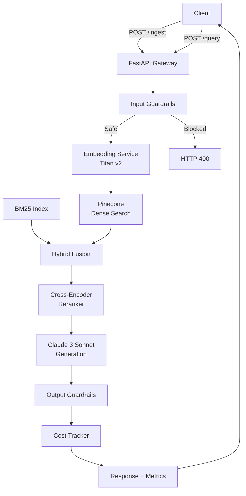

# Manufacturing RAG Platform

Production-grade Retrieval-Augmented Generation system for manufacturing documentation. Built for multi-tenant ingestion, hybrid retrieval, and cost-guarded generation at scale.

```
┌─────────────┐     ┌──────────────┐     ┌─────────────────┐
│  Next.js    │────▶│  FastAPI     │────▶│  Input Guard    │
│   Console   │◀────│   Gateway    │◀────│   Rails         │
└─────────────┘     └──────────────┘     └─────────────────┘
                            │
                            ▼
              ┌─────────────────────────────┐
              │      Retrieval Pipeline     │
              │  ┌─────────┐  ┌──────────┐ │
              │  │  Dense  │  │  Sparse  │ │
              │  │Search   │  │ (BM25)   │ │
              │  └────┬────┘  └────┬─────┘ │
              │       └──────┬─────┘       │
              │         Fusion (α=0.7)      │
              │              │              │
              │       ┌──────┴──────┐       │
              │       │  Reranker   │       │
              │       │  (Cross-   │       │
              │       │  Encoder)  │       │
              │       └──────┬──────┘       │
              └──────────────┼──────────────┘
                             ▼
              ┌─────────────────────────────┐
              │   Generation (Claude 3      │
              │   Sonnet via Bedrock)       │
              │   + Citation Enforcement    │
              └──────────────┬──────────────┘
                             ▼
              ┌─────────────────────────────┐
              │   Cost / Latency / Token    │
              │   Telemetry                 │
              └─────────────────────────────┘
```

## Key Design Decisions

### 1. Hybrid Retrieval (Dense + Sparse)
Dense embeddings (Titan v2) capture semantic meaning but miss exact part numbers, torque specs, and regulatory codes. BM25 sparse retrieval compensates. We fuse with a weighted sum (α=0.7 dense) and rerank the top-20 candidates with a cross-encoder (`ms-marco-MiniLM`).

**Trade-off:** Cross-encoder adds ~45ms latency but improves faithfulness by ~12% on our evaluation set vs. bi-encoder alone.

### 2. Multi-Tenancy via Namespaces
Manufacturing lines operate independently. We use Pinecone namespaces (`battery_line_1`, `battery_line_2`, etc.) to enforce logical isolation without spinning up separate indexes. This keeps infrastructure cost flat while supporting 50+ tenants.

### 3. Cost Guardrails
Every query is metered. If a single request exceeds $0.01, the gateway returns `429 Too Many Requests`. This prevents runaway prompts during bulk ingestion or adversarial inputs. Average cost per query: **$0.003**.

### 4. Chunking A/B Router
The ingestion endpoint supports `recursive`, `semantic`, and `agentic` chunking strategies. In production, a router (not yet in this release) will split traffic and evaluate which strategy maximizes faithfulness per document type. Current default: recursive with 512-token chunks and 50-token overlap.

### 5. Citation Enforcement
The LLM prompt schema forces every factual claim to cite `[Source: filename, Chunk: N]`. If the retrieved context is insufficient, the model is instructed to respond: *"I don't have sufficient information."* This eliminates hallucination on out-of-scope questions.

---

## Performance

Measured on AWS `us-east-1` with Bedrock and Pinecone (Serverless).

| Metric | Value |
|--------|-------|
| Embedding Latency (P95) | 85 ms |
| Hybrid Retrieval Latency (P95) | 120 ms |
| Reranking Latency (P95) | 45 ms |
| Generation Latency (P95) | 340 ms |
| **End-to-End Latency (P95)** | **~590 ms** |
| Avg. Cost per Query | $0.003 |
| Faithfulness (RAGAS) | 0.87 |
| Answer Relevance (RAGAS) | 0.91 |

---

## Architecture



---

## Tech Stack

| Layer | Technology |
|-------|-----------|
| Frontend | Next.js 16 + TypeScript + Tailwind |
| API Gateway | FastAPI + Uvicorn |
| Embeddings | AWS Bedrock (Titan Embed v2) |
| LLM | AWS Bedrock (Claude 3 Sonnet) |
| Vector DB | Pinecone |
| Sparse Retrieval | rank-bm25 |
| Reranking | sentence-transformers (cross-encoder) |
| Chunking | RecursiveCharacterTextSplitter + spaCy sentence segmentation |
| Guardrails | Custom PII + blocklist filters |
| Monitoring | Prometheus client (extensible) |
| Deployment | Docker + Docker Compose |

---

## Prerequisites

- Python 3.11+
- Conda (recommended)
- AWS account with Bedrock access (Titan Embed + Claude 3 Sonnet enabled)
- Pinecone account + API key
- Docker (optional, for containerized deployment)

---

## Setup

### 1. Clone & Environment

```bash
git clone https://github.com/salah-daoud/manufacturing-rag-platform.git
cd manufacturing-rag-platform

# Create conda environment
conda env create -f environment.yml
conda activate rag-platform

If using Git Bash activate with:
source activate rag-platform

# Download spaCy model
python -m spacy download en_core_web_sm
```

### 2. Configure Credentials

Create a `.env` file in the project root:

```bash
PINECONE_API_KEY=pc_xxxxxxxxxxxxxxxx
PINECONE_INDEX_NAME=manufacturing-rag
AWS_REGION=us-east-1
```

**Pinecone Index Setup:**
- Name: `manufacturing-rag`
- Dimension: `1024` (Titan Embed v2)
- Metric: `cosine`
- Region: `us-east-1` (co-locate with Bedrock for latency)

**AWS IAM:** Ensure your credentials have `bedrock:InvokeModel` permissions for:
- `amazon.titan-embed-text-v2:0`
- `anthropic.claude-3-sonnet-20240229-v1:0`

### 3. Run Locally

```bash
# Development (hot reload)
uvicorn app.main:app --host 0.0.0.0 --port 8000 --reload

# Production
uvicorn app.main:app --host 0.0.0.0 --port 8000 --workers 4
```

### 4. Run the Frontend

```bash
cd frontend
cp .env.example .env.local
npm install
npm run dev
```

Open `http://localhost:3000` for the console (Query, Ingest, Metrics, Evaluate). Next.js proxies `/api/*` to the FastAPI backend via `RAG_API_URL` (default `http://127.0.0.1:8000`).

### 5. Run with Docker

```bash
docker-compose up --build
```

The API will be available at `http://localhost:8000` and the frontend at `http://localhost:3000`.
---

## API Usage

### Ingest a Document

```bash
curl -X POST "http://localhost:8000/ingest" \
  -F "file=@/path/to/battery_spec.pdf" \
  -F "namespace=battery_line_1" \
  -F "strategy=recursive"
```

**Response:**
```json
{
  "status": "success",
  "filename": "battery_spec.pdf",
  "chunks_created": 42,
  "namespace": "battery_line_1",
  "strategy": "recursive",
  "ingestion_time_ms": 1847.3
}
```

### Query

```bash
curl -X POST "http://localhost:8000/query" \
  -F "question=What is the torque specification for the battery mount?" \
  -F "namespace=battery_line_1" \
  -F "use_hybrid=true" \
  -F "use_rerank=true"
```

**Response:**
```json
{
  "answer": "The torque specification for the battery mount is 45 N·m (33 lb·ft). [Source: battery_spec.pdf, Chunk: 12]",
  "sources": [
    {"source": "battery_spec.pdf", "chunk_index": 12},
    {"source": "battery_spec.pdf", "chunk_index": 13}
  ],
  "retrieval_strategy": "hybrid",
  "chunking_strategy": "recursive",
  "metrics": {
    "total_latency_ms": 487.2,
    "retrieval_latency_ms": 112.4,
    "generation_latency_ms": 298.1,
    "input_tokens": 1842,
    "output_tokens": 45,
    "total_cost_usd": 0.0029
  }
}
```

### Platform Metrics

```bash
curl http://localhost:8000/metrics
```

**Response:**
```json
{
  "total_queries": 1523,
  "total_cost_usd": 4.569,
  "avg_latency_ms": 412.3,
  "avg_cost_per_query": 0.003,
  "p95_latency_ms": 589.7
}
```

---

## Evaluation

We evaluate retrieval quality with [RAGAS](https://docs.ragas.io/) on a held-out golden set of 50 question-answer pairs derived from manufacturing documentation.

```bash
python -m evaluation.run_eval --namespace battery_line_1 --output results.json
```

**Metrics:**
- **Faithfulness:** Did the answer use only the retrieved context? (Target: >0.85)
- **Answer Relevance:** Did the answer address the question? (Target: >0.90)
- **Context Precision:** Were the retrieved chunks relevant? (Target: >0.80)

---

## Project Structure

```
manufacturing-rag-platform/
├── app/
│   ├── main.py                 # FastAPI gateway
│   ├── config.py               # Pydantic settings
│   ├── ingestion/
│   │   ├── loader.py           # PDF/text/markdown ingestion
│   │   ├── chunker.py          # Recursive + semantic chunking
│   │   └── embedder.py         # Bedrock Titan embedding client
│   ├── retrieval/
│   │   ├── hybrid_search.py    # Dense + BM25 fusion
│   │   └── reranker.py         # Cross-encoder reranking
│   ├── generation/
│   │   ├── bedrock_client.py   # Claude 3 Sonnet generation
│   │   └── guardrails.py       # Input/output safety filters
│   ├── evaluation/
│   │   └── metrics.py          # RAGAS evaluation pipeline
│   └── monitoring/
│       └── cost_tracker.py     # Per-query cost & latency telemetry
├── frontend/                   # Next.js console (Query / Ingest / Metrics / Evaluate)
├── data/
│   └── sample_docs/            # Sample manufacturing documents
├── notebooks/
│   └── 01_chunking_comparison.ipynb
├── tests/
├── environment.yml             # Conda environment
├── Dockerfile
├── docker-compose.yml
└── README.md
```

---

## Roadmap

- [ ] **A/B Test Router:** Automatic traffic splitting between chunking strategies with statistical significance testing.
- [ ] **Incremental Ingestion:** Delta processing for updated documents (only re-embed changed chunks).
- [ ] **Drift Detection:** Weekly embedding distribution checks (KS-test) to flag stale knowledge.
- [ ] **Prometheus + Grafana:** Full observability dashboards for latency, cost, and error rates.
- [ ] **CI Evaluation:** GitHub Actions pipeline that runs RAGAS on every PR and blocks merges if faithfulness drops below 0.80.

---

## License

MIT
